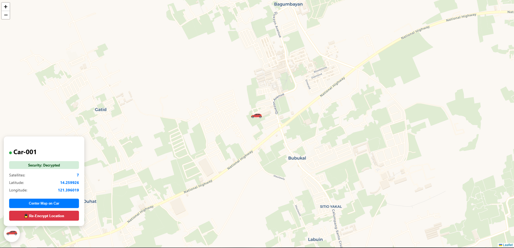

# 🚗 Car-001 Live Fleet Tracker (Secure Edition)

A professional-grade, privacy-conscious vehicle tracking system. This system allows the driver to toggle "Privacy Mode" physically from the car, while providing the owner with "Master Override" capabilities via a secure web dashboard.

 

---

## 📝 Description
This project provides a real-time, high-security vehicle monitoring solution. It features a unique **"Default Secure"** architecture: tracking data is encrypted by default on the web dashboard to protect driver privacy. Authorized users can decrypt the location on-demand via a Master Override, and drivers can toggle visibility instantly using a hardware privacy button inside the vehicle.

## ✨ Key Security Features
* **Default Secure:** All location data is encrypted (`*** ENCRYPTED ***`) on the dashboard by default.
* **Hardware Privacy Toggle:** A physical button allows the driver to toggle Privacy Mode on/off, providing instant, tactile control.
* **Master Override:** Owners can reveal the location of an "Encrypted" vehicle by clicking the **"🔓 Decrypt Car Location"** button on the dashboard.
* **Automatic Vanish:** To prevent stale data, the system automatically removes the car marker from the map if it goes offline for more than 20 seconds.
* **Non-Blocking Logic:** The hardware handles privacy transitions instantly without needing system reboots, ensuring continuous connectivity.

## ⚙️ Updated Architecture
1. **Data Acquisition:** ESP32 collects GPS data and monitors the Privacy Button state.
2. **Transmission:** Data is batched and sent to the Blynk Cloud.
3. **Encryption Gatekeeper:** The dashboard fetches telemetry and applies security layers:
    - If `Privacy Mode == ON` AND `Override == OFF`: Marker hidden, data encrypted.
    - If `Privacy Mode == OFF` OR `Override == ON`: Marker visible, data decrypted.
4. **Offline Watchdog:** The dashboard calculates a 20-second heartbeat window to determine device connectivity.

## 🚀 Recent Changelog
### v2.0.0 (Privacy-Focused Update)
* **Added:** Hardware Privacy Mode button with OLED feedback.
* **Added:** "Default Secure" encryption layer on the web dashboard.
* **Added:** Master Override feature for authorized fleet owners.
* **Improved:** Offline detection reduced from 90s to 20s for tighter security.
* **Fixed:** Resolved "static snow" on OLED during startup with a 1000ms delay.
* **Improved:** Modular codebase (split into `index.html`, `style.css`, and `script.js`).

## 🛠️ Updated Technologies
* **Hardware:** ESP32, SIM800L/Air780E, GPS, SSD1306 OLED, Toggle Button.
* **Frontend:** HTML5, CSS3, JavaScript (Leaflet.js for Mapping).
* **Backend:** Blynk IoT REST API (Secure Batch Updates).

## 🚀 Getting Started
1. **Blynk:** Ensure V1-V4 are set up, and your dashboard logic handles the encryption flow.
2. **Wiring:** Ensure the Privacy Button is connected to GPIO 4 (Input Pullup).
3. **Setup:** Open `script.js` and set your `blynkToken` and `blynkServer`.
4. **Deploy:** Upload the `.ino` sketch to your ESP32.

## ⏩ Future Enhancements
* **Trip History:** Storing historical coordinate arrays for automated route playback.
* **Geofencing:** Automated alerts if the vehicle leaves the Santa Cruz/Laguna operating zone.
* **Battery Monitoring:** Voltage telemetry to warn the owner if the car battery is draining while parked.

## 🤝 Acknowledgements
* **Leaflet.js** for the mapping library.
* **Blynk IoT** for the seamless cloud integration.
* **CARTO** for the map tile styles.

## 📄 License
This project is licensed under the MIT License - see the LICENSE file for details.